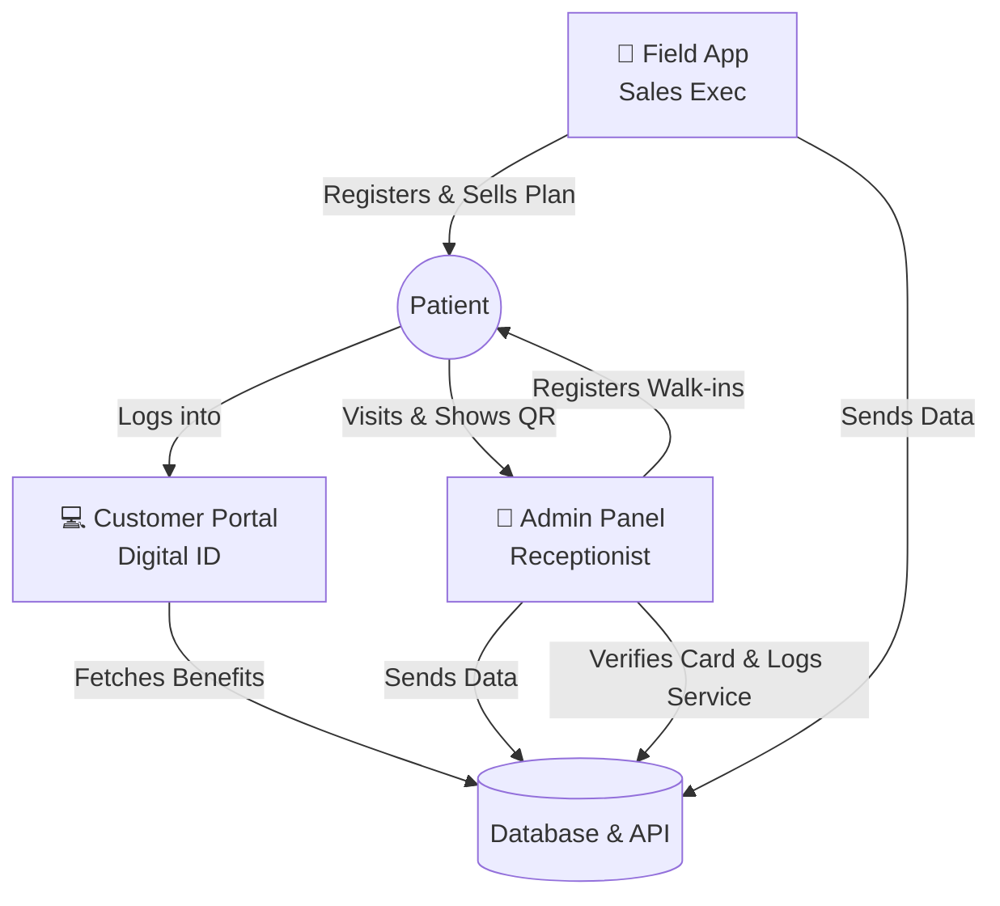

# Namma Health Card System - Complete Project Overview

Welcome to the Namma Health Card System! This document explains the entire architecture, workflow, and capabilities of the platform in simple terms. It serves as a guide for both non-technical stakeholders and technical developers.

---

## 🏗️ 1. The Big Picture: How It Works

The Namma Health Card System is designed to bridge the gap between hospitals and patients by offering digital health memberships. The workflow is simple:

1. **Patient Registration:** A Field Executive (door-to-door) or a Hospital Receptionist registers a patient into the system.
2. **Card Generation:** The system instantly generates a unique Digital Health Card (e.g., `NHC-2026-00001`) linked to a specific membership plan.
3. **Patient Access:** The patient logs into the Customer Portal using their phone number and card number to view their digital ID and benefits.
4. **Hospital Visit:** The patient shows their digital QR code at a partner hospital. The receptionist scans/verifies the card and logs the service, instantly applying the plan's discounts.
5. **Data Tracking:** The hospital administration can view real-time statistics of card usage, revenue generated, and total discounts provided.

### Visual Workflow

---

## 🧩 2. System Modules & Tech Stack

The system is broken down into four distinct pieces that all talk to a central database.

### ⚙️ A. The Backend API (The Brain)
This is the central server that holds all the logic and securely stores the data. None of the other apps talk directly to each other; they all talk to the Backend.
- **Tech Stack:** Node.js, Express.js
- **Database:** PostgreSQL (Stores Users, Patients, Hospitals, Plans, Cards, and Service History)
- **Security:** JSON Web Tokens (JWT) for secure logins, Bcrypt for password hashing.
- **Key APIs Used:**
  - `/api/auth/login` (Staff login)
  - `/api/auth/patient-login` (Patient login)
  - `/api/patients` (Registration)
  - `/api/cards/verify` (QR Code scanning)
  - `/api/services` (Logging hospital visits and calculating discounts)
  - `/api/dashboard/stats` (Gathering analytics)

### 🖥️ B. Hospital Admin Panel
Used by Hospital Receptionists and Super Admins on desktop computers.
- **Tech Stack:** React (Vite), TailwindCSS, Recharts (for graphs)
- **What it does:** 
  - Allows receptionists to verify a patient's card by typing the number or scanning the QR code.
  - Calculates the final bill after applying the specific card's discount.
  - Shows an analytics dashboard of hospital performance.
  - Manages membership plans and hospital staff.

### 📱 C. Field Executive App
Used by sales executives working on the ground to sell health cards directly to people's homes.
- **Tech Stack:** React Native (Expo)
- **What it does:**
  - Optimized for mobile phones.
  - Features a rapid, step-by-step wizard to register a patient, select a plan, and instantly generate their card on the spot.
  - Shows the executive their daily sales targets and history.

### 🌐 D. Customer Portal
Used by the patients themselves.
- **Tech Stack:** Next.js 15, TailwindCSS
- **What it does:**
  - Secure login using Phone Number + Card Number (no password needed).
  - Displays a beautiful Digital Health Card with a scannable QR Code.
  - Shows a list of what benefits their plan provides.
  - Shows a "Savings Tracker" logging every hospital visit and how much money they saved.

---

## 🚀 3. Optimizations & Improvements (Under Active Development)

We are actively implementing features to improve safety, speed, and market appeal. **This document acts as a living record** of our technical decisions and temporary workarounds.

### 🔒 Safety & Security

1. **OTP Verification Integration (Active):** 
   - **Current State:** Patients log in to the Customer Portal using their Phone Number + Card Number, then verify with a 6-digit OTP valid for 5 minutes.
   - **How it works:** A code is generated in the backend and saved to the database. The system attempts to email it via Gmail (Nodemailer).
   - **Dev Mode Fallback:** If Gmail credentials are not set in `.env`, the system will **not crash**. Instead, it prints the OTP directly into the backend server terminal so developers can still test the login flow.
   - **Production Requirement:** Set `GMAIL_USER` and `GMAIL_APP_PASSWORD` (Gmail App Password) in the backend `.env` file to enable real email delivery.
   - **Future Production Upgrade:** Replace Gmail with an SMS gateway (Twilio/AWS SNS) to send OTPs to mobile phones, which is far more reliable for patients who may not have registered an email.

2. **Auto-Logout & Session Management (Active):**
   - **Current State:** The React Native Field App tracks user interaction (`PanResponder`).
   - **Implementation:** Field executives are forcefully logged out if the app remains completely idle for 15 minutes, preventing unauthorized access to patient data on unattended or stolen phones.

3. **Data Encryption (Active):**
   - **Current State:** We use a hybrid approach to encryption.
   - **Implementation:** 
     - **PostgreSQL:** Handles full Disk Encryption at the infrastructure level.
     - **Node.js (Application Layer):** Very sensitive fields (like Patient `address`) are encrypted natively in Node.js (AES-256-CBC) *before* being inserted into the database. This ensures that even raw database dumps do not reveal sensitive PII.

### ⚡ Speed & Performance
1. **Database Indexing (Active):** We have added composite indexes on `(hospital_id, visit_date)` in the `service_utilization` table, significantly speeding up dashboard analytics and data filtering across millions of records.
2. **Offline Support for Field App (Active):** Uses local SQLite storage in the React Native app so field executives can register patients even in rural areas without internet, syncing the data automatically when they get a connection.
3. **Redis Caching (Reverted/Planned):** Caching dashboard statistics with Redis was briefly tested but has been reverted to prioritize direct database queries for real-time accuracy during the MVP phase. It will be reintroduced as load increases.

### ✨ Appeal & User Experience
1. **Automated PDF Receipts:** When a hospital receptionist logs a service, the system automatically generates a PDF receipt and emails it.
2. **Payment Gateway Integration:** Allow patients to upgrade or renew their expired membership plans directly from the Customer Portal using Razorpay or Stripe.
3. **Push Notifications:** Send mobile alerts to patients reminding them of their unused benefits (e.g., *"Don't forget your free annual checkup before your card expires!"*).
4. **Dark Mode:** Add an automatic dark mode toggle across all web panels.
